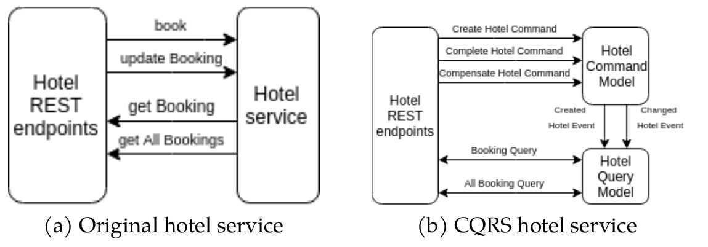

# hotel-service-axon
This is proof of concept application for using LRA annotation on JAX-RS endpoints in the Axon Spirng-Boot application.
This service is the same as the **hotel-service** in the [Narayana quickstart](https://github.com/jbosstm/quickstart/tree/master/rts/lra)
The REST layer is the same as original however the architecture of the application is based on event-sourcing and CQRS using Axon Framework.
The original **hotel-service** can be substituted by this service. Only one different is that this service use path `/hotel` instead of `/`
###### NOTE:
```
Due to the issue JBTM-3161, it is need to use Narayana version <= 5.9.6. 
During the building quickstart in tag 5.9.6, it needs to update version of microprofile-lra in the pom.xml. 
```
Comparison between original hotel service in the Narayana quickstart and this Axon Spring-boot hotel service application:


# How to run

- First, the LRA quickstart repository should be cloned and set up. Following README in that [repo](https://github.com/jbosstm/quickstart/tree/master/rts/lra).
- When the LRA quickstarts is running, stop the original **hotel-service**
- Before continue, It needs to update original **trip-controller** in the LRA quickstart. Add suffix `/hotel` [here](https://github.com/jbosstm/quickstart/blob/master/rts/lra/trip-controller/src/main/java/io/narayana/rts/lra/demo/tripcontroller/TripController.java#L94)

It needs to set ALLOW_ENCODED_SLASH and ALLOW_BACKSLASH to true. Without them, the get endpoint will not work correctly (returns 400 when query param contains encoded slash).

```
git clone https://github.com/mkralik3/hotel-service-axon.git
cd hotel-service-axon
mvn clean install
docker run -it --rm --name my-axon-server -p 8024:8024 -p 8124:8124 axoniq/axonserver
java -Dorg.apache.tomcat.util.buf.UDecoder.ALLOW_ENCODED_SLASH=true -Dorg.apache.catalina.connector.CoyoteAdapter.ALLOW_BACKSLASH=true -jar target/hotel-axon-0.0.1-SNAPSHOT.jar
```


