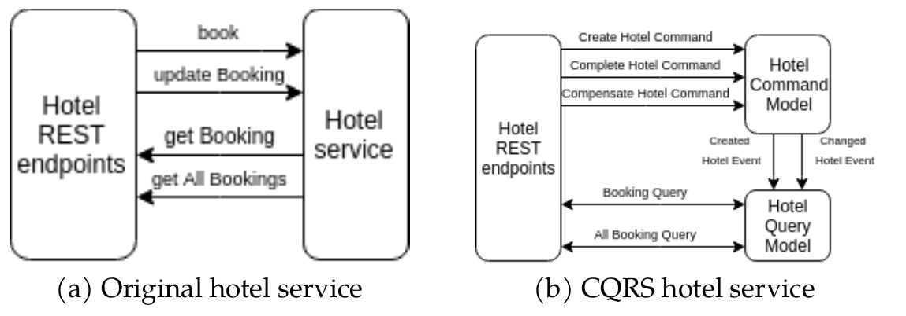

= Hotel Axon Service

This is proof of concept application for using LRA annotation on JAX-RS endpoints in the Axon Spirng-Boot application.
This service is the same application as the *hotel-service* in the https://github.com/jbosstm/quickstart/tree/master/rts/lra[Narayana quickstart].
The REST layer is the same as original however the architecture of the application is based on event-sourcing and CQRS using Axon Framework.
The original *hotel-service* can be substituted by this service.

Comparison between original hotel service in the Narayana quickstart and this Axon Spring-boot hotel service application:

== How to run

=== Prerequisites

* First, the LRA quickstart repository should be cloned and set up. Following README in that https://github.com/jbosstm/quickstart/tree/master/rts/lra[repo].
* When the LRA quickstart is running, stop the original *hotel-service*

=== Start Hotel Axon service

* Start Axon Server which provides event store and routes for messages
....
docker run -it --rm --name my-axon-server -p 8024:8024 -p 8124:8124 axoniq/axonserver:4.2
....
* When the Axon Server is running, we can run the *hotel-axon-service*

It needs to set ALLOW_ENCODED_SLASH and ALLOW_BACKSLASH to true. Without them, the get endpoint will not work correctly (returns 400 when query param contains encoded slash).

....
mvn clean package
java -Dorg.apache.tomcat.util.buf.UDecoder.ALLOW_ENCODED_SLASH=true -Dorg.apache.catalina.connector.CoyoteAdapter.ALLOW_BACKSLASH=true -jar hotel-axon-service/target/hotel-axon-service-1.0-SNAPSHOT.jar
....

=== Trip reservation

When all services are running, you can do a trip reservation via original LRA quickstart https://github.com/jbosstm/quickstart/tree/master/rts/lra#update-a-trip-booking[client].
....
mvn -f trip-client/pom.xml exec:java -Dservice.http.host="localhost" -Dservice.http.port=8084
....

After cancel or provision the trip, you can also see used commands and events in the hotel-axon-service log.
Also Axon Server provides the overview on http://localhost:8024/